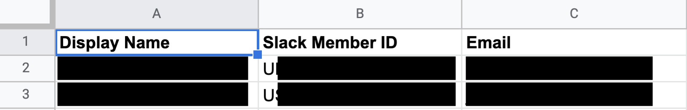

# On-Call Bot Serverless
This is a Typescript slack bot which allows posting schedule data to a Slack channel. It uses AWS Lambda and the [serverless](https://www.serverless.com/) framework.

The baseline data source is a Google Spreadsheet. This uses [slack bolt](https://github.com/slackapi/bolt-js/tree/main/examples/getting-started-typescript) and [node google spreadsheet API](https://theoephraim.github.io/node-google-spreadsheet/#/getting-started/authentication).


## Setup
The bot requires several environment variables to run.

| Name | Description |
| ---- | ----------- |
| SLACK_SIGNING_SECRET | Information for the app to interact with Slack |
| SLACK_BOT_TOKEN | Also used for Slack API |
| GOOGLE_SERVICE_ACCOUNT_EMAIL | Email for the service account, which has been granted access to the Google Spreadsheet |
| GOOGLE_PRIVATE_KEY | Creds for access. |
| SLACK_GOOGLE_SHEET_ID | ID of the google sheet so Slack can access it |

An admin must install the Bot in the Slack workspace in order to use Slack slash commands.

## Slack Usage - Slash Commands
`/oncall help` to see slash command help

`/oncall now` to see who is on call right now.

`/oncall schedule` to see the next few weeks of schedule

`/oncall post schedule` to post the next few weeks of schedule and @ listed users

`/oncall refresh` to refresh data from the spreadsheet

The message `:arrow_right: *On-call Reminder* :arrow_left:` will trigger a schedule `now` + `post schedule`

`/oncall` - same as `/oncall schedule`

## Data Format - Spreadsheet
The baseline data lives in a Google Spreadsheet. The library used to access this sheet treats the first row as column names, so format must be preserved.

### Schedule

This sheet is the main schedule.
* `Date Start`
* `Date End`
* `Final Primary`
* `Final Secondary`

Names in the _Final Primary_ and _Final Secondary_ columns are primary keys which map to _Team Data_.

### Team Data

This sheet maps users' first and lastname to Slack Member IDs.
* `Display Name`
* `Slack Member ID`

### Slack Data

List of Slack workspace channels and IDs, which will be custom to each workspace.
* `channel`
* `id`

### Slack Messages

Flat list of messages to display.
* `Message`

Substitutions are enabled for the start and end of on-call period.
* `${period_start}`
* `${period_end}`

### Flat Data

This is a simple list of key-value pairs, with cells in the first row (column names) as the keys, and the next row containing all respective data.
* `resources` - added to messaging when on-call schedule is posted

## Deployment
SLS makes this easy to deploy to AWS.
```
sls deploy --stage prod --aws-profile profile-name
```